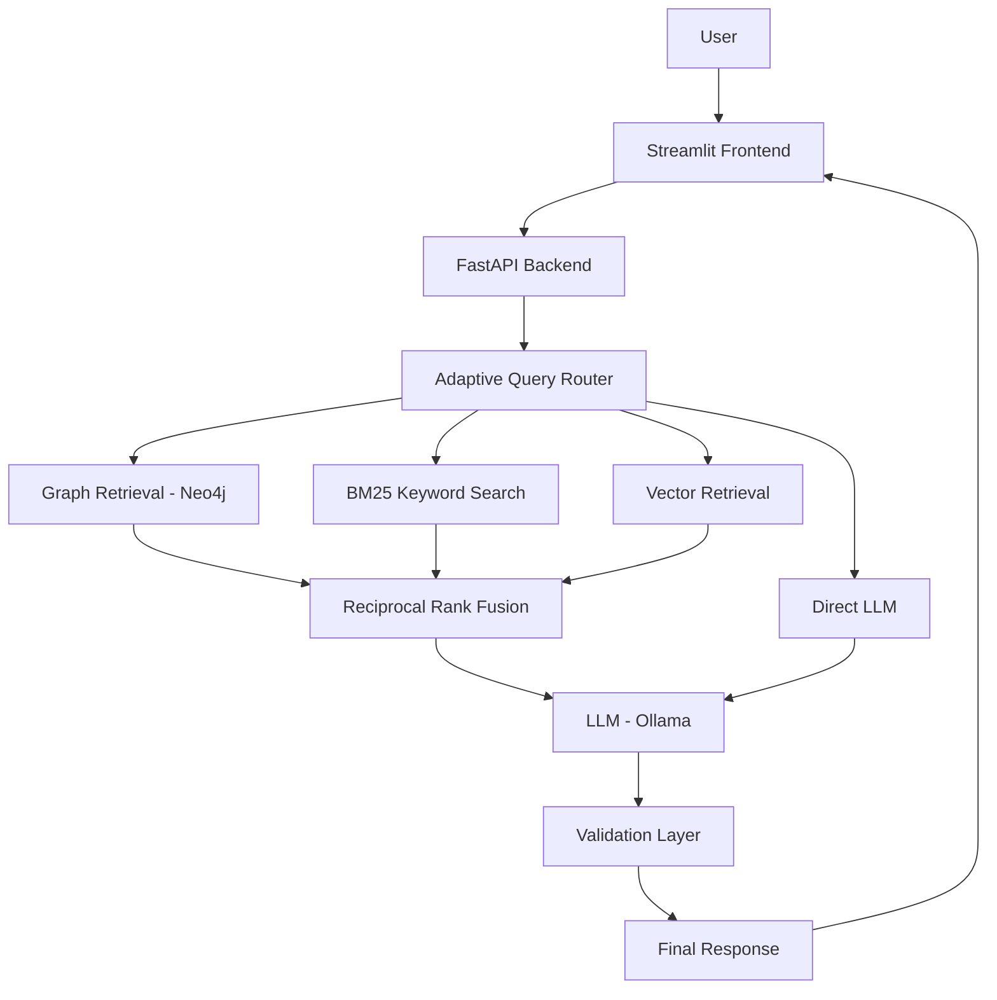

# 🚑 MedRoute — Adaptive Hybrid KG–RAG Medical Assistant

## 📌 Overview

MedRoute is an intelligent healthcare assistant that combines **Knowledge Graphs (Neo4j)** with **Retrieval-Augmented Generation (RAG)** and **adaptive query routing** to provide accurate, context-aware, and reliable medical responses.

---


## 🏗️ System Architecture




## 🚀 Key Features

### 🧠 Hybrid Retrieval System
- Graph-based retrieval (Neo4j Cypher queries)
- BM25 keyword search
- Vector similarity search

### 🔀 Adaptive Query Routing
- Classifies queries into:
  - Factual  
  - Relational  
  - Complex  
  - General  
- Dynamically selects optimal retrieval strategy

### 🔗 Knowledge Graph Integration
- Models relationships between diseases, symptoms, and treatments  
- Enables multi-hop reasoning  

### ⚡ Reciprocal Rank Fusion (RRF)
- Combines multiple retrieval results  
- Improves ranking accuracy and relevance  

### 🤖 Local LLM (Ollama Integration)
- Uses LLaMA-based models for response generation  
- Ensures privacy and offline capability  

### 🛡️ Low Hallucination Output
- RAG grounding ensures factual consistency  
- Observed **0% hallucination** in evaluation  

### 📊 Evaluation Pipeline
- 60-query benchmark testing  
- Measures:
  - Accuracy  
  - Relevancy  
  - Coverage  
  - Routing Precision  

## 📂 Project Structure

```bash
MED-ROUTE-final/
│
├── chatbot_api/
│   ├── src/
│   │   ├── agents/           # Routing + AI logic
│   │   ├── retrieval/        # Graph, BM25, Vector
│   │   ├── ingest/           # Data pipeline
│   │   └── main.py           # FastAPI server
│
├── chatbot_frontend/
│   └── src/                  # Streamlit UI
│
├── tests/
│   ├── eval/
│   └── run_route_eval_60.py  # Evaluation script
│
└── README.md
```
## 📊 Performance Highlights

| Metric | Value |
|--------|------|
| Accuracy | 68.7% |
| Relevancy | 71.8% |
| Coverage | 74.7% |
| Routing Precision | 100% |
| Hallucination Rate | 0% |

---

## 🔍 Key Observations

- Adaptive routing improves response completeness (**4.08 vs 3.74**)  
- Complex queries remain the most challenging due to multi-step reasoning  
- Hybrid retrieval significantly enhances relevance and coverage  
- Graph-based retrieval improves performance for relational queries  
- RAG grounding ensures low hallucination and reliable outputs  
- System maintains stable performance across different query types  

---

## 🔄 Workflow
```text
User → Frontend → FastAPI → Query Router → Hybrid Retrieval (KG + BM25 + Vector) → RRF → LLM → Response
```


## 🧪 Example Query

```text
What are the symptoms and treatments of Acne?
```

### 👉 System Flow

- Classifies → **Factual Query**  
- Retrieves → **Graph + BM25 Retrieval**  
- Generates → **Context-aware response using RAG**  


